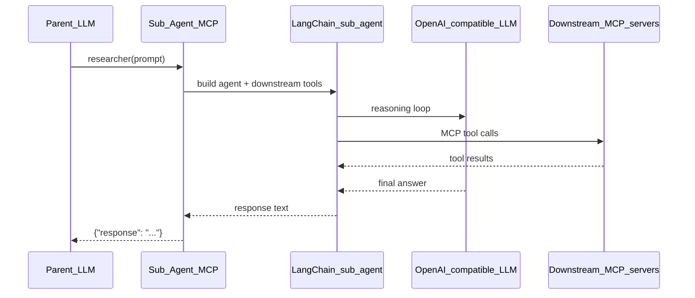
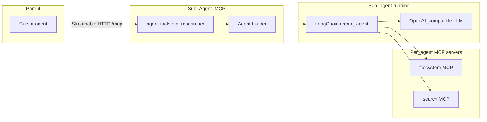

# Sub-Agent MCP

[](https://github.com/systemgroupnet/Sub-Agent-MCP/actions/workflows/ci.yml)
[](LICENSE)
[](https://www.python.org/downloads/)
[](https://github.com/systemgroupnet/Sub-Agent-MCP/pkgs/container/sub-agent-mcp)

Production-ready Python MCP server for **LLM delegation and sub-agent orchestration**. A parent LLM (for example, Cursor’s agent) connects to this server and delegates work by calling a **tool named after each agent** defined in YAML (for example, `researcher`).

Each sub-agent is defined in YAML with its own LLM, system prompt, and optional downstream MCP tool servers.

## Table of contents

- [What is this?](#what-is-this)
- [Why use it?](#why-use-it)
- [Features](#features)
- [Prerequisites](#prerequisites)
- [Quick start](#quick-start)
- [Verify installation](#verify-installation)
- [Connect Cursor](#connect-cursor)
- [How it works](#how-it-works)
- [Agent configuration](#agent-configuration)
- [MCP tools reference](#mcp-tools-reference)
- [Environment variables](#environment-variables)
- [Project layout](#project-layout)
- [Development](#development)
- [Docker image and releases](#docker-image-and-releases)
- [Troubleshooting](#troubleshooting)
- [License](#license)

## What is this?

Sub-Agent MCP sits between a **parent LLM** and one or more **specialized sub-agents**:

1. The parent connects to this server over **Streamable HTTP** at `/mcp`.
2. At startup, each agent in `agents.yaml` is registered as an MCP tool named by its `id`.
3. The parent calls that tool with a `prompt`; the server runs the sub-agent and returns the final response.

Each sub-agent is a [LangChain](https://github.com/langchain-ai/langchain) agent with its own OpenAI-compatible LLM, system prompt, and optional connections to other MCP servers (filesystem, search, your own tools, and so on). Tool access can be restricted per agent with an allowlist.



This is different from giving one agent every tool in the workspace: the parent stays lightweight, roles stay explicit, and each sub-agent only sees the MCP servers and tools you configure for it.

## Why use it?

- **Delegation without context bloat** — The parent calls agent tools directly; it does not need every downstream tool schema in its own context.
- **Per-role configuration** — Different `id`s can use different models, prompts, MCP servers, and tool allowlists.
- **Production-oriented** — Pydantic-validated YAML, structured logging, Docker health checks, CI, and GHCR images on release tags.
- **OpenAI-compatible providers** — Point `llm.base_uri` at OpenAI, Azure, Ollama, LM Studio, or any compatible API.

## Features

**Transport**

- Streamable HTTP only (`streamable-http`); no stdio or legacy SSE.

**Configuration**

- YAML agent definitions with strict Pydantic validation.
- Environment substitution: `${VAR}` and `${VAR:-default}`.

**Runtime**

- LangChain 1.x `create_agent` with OpenAI-compatible chat models.
- Per-agent MCP connections via `langchain-mcp-adapters`, with optional `server.tool` allowlists.

**Security**

- Agent tool descriptions never expose API keys.

**Operations**

- Structured logging ([structlog](https://www.structlog.org/)).
- Docker image with health check; GitHub Actions CI.
- Container images published to GHCR on version tags (`v0.x.y`).

**MCP tools exposed by this server**

Each agent in `agents.yaml` is registered as a tool named by its `id` (for example, `researcher`). Each tool accepts a single `prompt` argument and runs that sub-agent.

## Prerequisites

| Requirement                                                  | Notes                                                       |
| ------------------------------------------------------------ | ----------------------------------------------------------- |
| Python 3.10+                                                 | CI uses 3.12; `requires-python >= 3.10` in `pyproject.toml` |
| API key for your LLM provider                                | Default example uses `OPENAI_API_KEY`                       |
| [uv](https://github.com/astral-sh/uv) (recommended) or `pip` | Matches CI install path                                     |
| Docker + Compose (optional)                                  | Recommended for first run; includes mock MCP tool servers   |

## Quick start

Choose one path. **Docker Compose is the fastest way** to run the full demo stack (server + mock tool servers).

### Path A — Docker Compose (recommended)

```bash
export OPENAI_API_KEY=sk-...
docker compose up --build
```

| Service             | Port | Endpoint                    |
| ------------------- | ---- | --------------------------- |
| Sub-Agent MCP       | 8000 | `http://localhost:8000/mcp` |
| Mock filesystem MCP | 8001 | `http://localhost:8001/mcp` |
| Mock search MCP     | 8002 | `http://localhost:8002/mcp` |

The bundled [config/agents.yaml](config/agents.yaml) uses **Docker network hostnames** (`filesystem-mcp`, `search-mcp`), which resolve correctly inside Compose.

### Path B — Local Python

```bash
uv sync --dev
# or: pip install -e ".[dev]"

cp config/agents.example.yaml config/agents.yaml   # if you don't have config/agents.yaml yet
export OPENAI_API_KEY=sk-...

python -m sub_agent_mcp.main
# or: uv run sub-agent-mcp
```

Server listens at `http://0.0.0.0:8000/mcp` (reachable as `http://localhost:8000/mcp` from your machine).

**Important:** The example config points MCP servers at Docker service names. For local Python you must either run the mock servers and use `localhost` URLs (see table below), or run only the mocks via Compose:

```bash
# Terminal 1: mock tool servers only
docker compose up filesystem-mcp search-mcp

# Terminal 2: sub-agent server (after editing agents.yaml URLs to localhost)
export OPENAI_API_KEY=sk-...
python -m sub_agent_mcp.main
```

#### Local vs Docker MCP URLs

| Environment                 | filesystem MCP URL               | search MCP URL               |
| --------------------------- | -------------------------------- | ---------------------------- |
| Docker Compose network      | `http://filesystem-mcp:8001/mcp` | `http://search-mcp:8002/mcp` |
| Host machine / local Python | `http://localhost:8001/mcp`      | `http://localhost:8002/mcp`  |

### Path C — Prebuilt image (GHCR)

Images are published on **git tags** matching `v*` (for example `v0.1.2`), not on every push to `main`.

```bash
docker run -p 8000:8000 \
  -e OPENAI_API_KEY=sk-... \
  -v "$(pwd)/config/agents.yaml:/app/config/agents.yaml:ro" \
  ghcr.io/systemgroupnet/sub-agent-mcp:latest
```

Mount your own `agents.yaml` and ensure MCP `url` values are reachable from inside the container (use host networking, service names, or `host.docker.internal` as appropriate).

## Verify installation

**OpenAPI document** (generated from registered MCP tools):

```bash
curl -s http://localhost:8000/mcp/openapi.json | head
```

**Open WebUI (OpenAPI tool server)** — Register as **OpenAPI** (not MCP):

| Field | Value |
|-------|--------|
| **URL** | `http://localhost:8000/mcp` (or `http://mcp.example.com/sub-agent/mcp` behind a proxy) |
| **OpenAPI path** | `openapi.json` (default) |

Open WebUI appends tool paths from the spec (for example `/tools/researcher`) to that URL:

```bash
curl -s -X POST http://localhost:8000/mcp/tools/researcher \
  -H 'Content-Type: application/json' \
  -d '{"prompt":"Summarize what tools you have access to."}'
```

**Docker health** — The image health check probes `http://127.0.0.1:8000/mcp`.

**Functional check** — After connecting Cursor (below), ask the parent agent to call the `researcher` tool with a short prompt. A successful run returns `{ "response": "..." }`.

## Connect Cursor

1. Open **Cursor Settings → MCP** (or edit your MCP config JSON).
2. Add the server:

```json
{
  "mcpServers": {
    "sub-agent-mcp": {
      "url": "http://localhost:8000/mcp"
    }
  }
}
```

3. Ensure the Sub-Agent MCP process is running and Cursor can reach `localhost:8000`. On WSL or Docker Desktop, confirm port forwarding if the server runs in a VM or container.
4. Reload MCP tools. You should see one tool per agent (for example, **`researcher`**).

**Example delegation prompt for the parent agent:**

> Call the `researcher` tool with prompt: "Summarize what tools you have access to."

**Other MCP clients** — Any client that supports **Streamable HTTP** can connect to `http://<host>:8000/mcp`. Refer to your client’s MCP documentation for URL-based server configuration; this server does not use stdio transport.

## How it works



**Agent tool flow**

1. Load and validate [config/agents.yaml](config/agents.yaml) (or `AGENTS_CONFIG_PATH`) at startup.
2. Register one MCP tool per agent, named by `id`.
3. When a tool is called, build an OpenAI-compatible chat model from that agent’s `llm.*`.
4. Connect to the agent’s `mcp_servers`, discover tools, apply `tool_allowlist` if set.
5. Run the LangChain agent loop (bounded by `AGENT_RECURSION_LIMIT`).
6. Return the final assistant message as `{ "response": "..." }`, or `{ "error": "..." }` on failure.

## Agent configuration

Agents are loaded from `config/agents.yaml` at startup. Override the path with `AGENTS_CONFIG_PATH`.

```yaml
agents:
  - id: researcher
    title: Research Agent
    description: "Agent specialized in research tasks"
    llm:
      base_uri: https://api.openai.com/v1
      api_key: ${OPENAI_API_KEY}
      model_id: gpt-4.1-mini
    system_prompt: |
      You are a helpful research assistant.
    mcp_servers:
      - name: filesystem
        transport: streamable_http
        url: http://filesystem-mcp:8001/mcp
        headers: {}
      - name: search
        transport: streamable_http
        url: http://search-mcp:8002/mcp
    tool_allowlist:
      - filesystem.read_file
      - search.web_search
```

Copy [config/agents.example.yaml](config/agents.example.yaml) as a starting point.

### Schema reference

| Field                   | Description                                                                                  |
| ----------------------- | -------------------------------------------------------------------------------------------- |
| `id`                    | Unique slug; must start with a lowercase letter, then lowercase letters, digits, `-`, or `_` |
| `title`                 | Human-readable name                                                                          |
| `description`           | Agent purpose (shown in the tool description exposed to the parent)                          |
| `llm.base_uri`          | OpenAI-compatible API base URL                                                               |
| `llm.api_key`           | API key; supports `${ENV_VAR}` substitution                                                  |
| `llm.model_id`          | Model identifier for the provider                                                            |
| `llm.reasoning_effort`  | Optional reasoning budget: `none`, `minimal`, `low`, `medium`, `high`, `xhigh`               |
| `llm.reasoning_summary` | Optional reasoning summary style: `auto`, `concise`, `detailed` (use `detailed` for longer)  |
| `llm.verbosity`         | Optional response verbosity for reasoning models: `low`, `medium`, `high`                      |
| `llm.max_tokens`        | Optional max output tokens (increase if answers are cut short)                               |
| `llm.temperature`       | Optional sampling temperature (`0.0`–`2.0`)                                                  |
| `system_prompt`         | System message for the sub-agent                                                             |
| `mcp_servers`           | List of remote MCP servers (`transport` must be `streamable_http`)                           |
| `mcp_servers[].name`    | Short name used in qualified tool names (`name.tool`)                                        |
| `mcp_servers[].url`     | Streamable HTTP MCP endpoint (must end with `/mcp` for standard layouts)                     |
| `mcp_servers[].bearer_token` | Optional bearer token; sent as `Authorization: Bearer ...` (supports `${ENV_VAR}`)      |
| `mcp_servers[].headers` | Optional extra HTTP headers merged with bearer auth                                          |
| `tool_allowlist`        | Optional list of `server.tool` names; omit to allow all tools from connected servers         |

Environment variable substitution supports `${VAR}` and `${VAR:-default}`. If `VAR` is unset and no default is provided, startup fails with a clear error.

### Configuration cookbook

**Second agent (different role, no extra MCP servers)**

```yaml
- id: writer
  title: Writing Agent
  description: "Drafts and edits text"
  llm:
    base_uri: https://api.openai.com/v1
    api_key: ${OPENAI_API_KEY}
    model_id: gpt-4.1-mini
  system_prompt: |
    You are a concise technical writer.
  mcp_servers: []
```

**Local model via Ollama (OpenAI-compatible)**

```yaml
llm:
  base_uri: http://localhost:11434/v1
  api_key: ${OLLAMA_API_KEY:-ollama}
  model_id: llama3.2
```

**Authenticated downstream MCP server**

```yaml
mcp_servers:
  - name: my_api
    transport: streamable_http
    url: https://mcp.example.com/mcp
    bearer_token: ${MY_MCP_TOKEN}
```

You can also set auth manually via `headers`:

```yaml
    headers:
      Authorization: "Bearer ${MY_MCP_TOKEN}"
```

**Allow all tools from connected servers** — Remove `tool_allowlist` or set it to `null` in YAML (omit the key).

### Startup validation errors

| Error                        | Typical cause                                                         |
| ---------------------------- | --------------------------------------------------------------------- |
| Config file not found        | Missing `config/agents.yaml`; copy from `agents.example.yaml`         |
| Environment variable not set | `${VAR}` without value or `${VAR:-}` default                          |
| Pydantic validation failed   | Invalid `id`, duplicate ids, empty `system_prompt`, wrong `transport` |
| Duplicate agent ids          | Two agents share the same `id`                                        |

## MCP tools reference

Each agent in `config/agents.yaml` is exposed as an MCP tool named by its `id`.

### Per-agent tools (for example, `researcher`)

| Parameter | Type   | Description                    |
| --------- | ------ | ------------------------------ |
| `prompt`  | string | User message for the sub-agent |

**Returns**

| Shape                   | Meaning                                                             |
| ----------------------- | ------------------------------------------------------------------- |
| `{ "response": "..." }` | Success; final assistant text                                       |
| `{ "error": "..." }`    | Failure (LLM error, MCP connection error, and so on)                |

Tool descriptions include `title`, `description`, and `model_id` but never API keys.

Errors are returned in the result object; they do not crash the MCP server process.

## Environment variables

| Variable                | Default              | Description                                                                                   |
| ----------------------- | -------------------- | --------------------------------------------------------------------------------------------- |
| `AGENTS_CONFIG_PATH`    | `config/agents.yaml` | Path to agents YAML                                                                           |
| `HOST`                  | `0.0.0.0`            | Server bind host                                                                              |
| `PORT`                  | `8000`               | Server bind port                                                                              |
| `LOG_LEVEL`             | `INFO`               | Log level (`DEBUG`, `INFO`, …)                                                                |
| `MCP_CLIENT_TIMEOUT`    | `30`                 | Timeout in seconds when connecting to downstream MCP servers; increase for slow tools         |
| `AGENT_RECURSION_LIMIT` | `25`                 | Maximum LangChain agent tool-loop steps per agent tool call; increase for multi-step tasks |

## Project layout

```
config/
  agents.example.yaml    # Template; copy to agents.yaml
  agents.yaml            # Runtime config (example committed in repo)
src/sub_agent_mcp/
  main.py                # FastMCP entry point
  server/                # Per-agent MCP tools, OpenAPI route
  agent/                 # LangChain builder and executor
  config/                # YAML loader and Pydantic schema
  mcp_client/            # Downstream MCP connections and tool registry
docker/mock_mcp/         # Dev mock filesystem and search MCP servers
tests/                   # pytest suite
scripts/bump-tag.sh      # Release tag helper (v0.major.minor)
```

## Development

```bash
uv sync --dev
uv run pytest -v
uv run ruff check src tests
```

Pull requests and pushes to `main` run lint and tests in [`.github/workflows/ci.yml`](.github/workflows/ci.yml).

## Docker image and releases

**Registry:** `ghcr.io/systemgroupnet/sub-agent-mcp`

**When images publish:** Pushing a git tag `v0.*` (for example `v0.1.2`) runs the Docker job after tests pass. Pushes to `main` alone do not publish images.

**Zero versioning:** Tags use `v0.major.minor` (for example `v0.1.0`, `v0.1.1`, `v0.2.0`).

In VS Code: **Terminal → Run Task → Release: bump zero-version tag and push**

Or manually:

```bash
./scripts/bump-tag.sh minor   # v0.1.0 → v0.1.1
./scripts/bump-tag.sh major   # v0.1.0 → v0.2.0
```

Image tags include the semver, `latest`, and major.minor aliases per the metadata action in CI.

## Troubleshooting

| Symptom                                  | Likely cause                                 | Fix                                                                                       |
| ---------------------------------------- | -------------------------------------------- | ----------------------------------------------------------------------------------------- |
| `Configuration error` on startup         | Missing or invalid `agents.yaml`             | Copy [config/agents.example.yaml](config/agents.example.yaml); check `AGENTS_CONFIG_PATH` |
| `Environment variable 'X' is not set`    | `${X}` without default in YAML               | `export X=...` or use `${X:-default}`                                                     |
| Agent tool MCP / connection errors       | Wrong MCP URL for your environment           | Use the [Local vs Docker MCP URLs](#local-vs-docker-mcp-urls) table                       |
| `401` / invalid credentials              | Bad `llm.api_key` for that agent             | Verify provider key and `base_uri`                                                        |
| Downstream MCP tools unavailable         | Mock servers not running or strict allowlist | Start `filesystem-mcp` / `search-mcp`; review `tool_allowlist`                            |
| Cursor cannot connect                    | Server not running or port blocked           | Confirm `curl http://localhost:8000/mcp/openapi.json`; check firewall / WSL networking    |
| Agent stops after few tool calls         | Recursion limit                              | Raise `AGENT_RECURSION_LIMIT`                                                             |

## License

[MIT](LICENSE)
